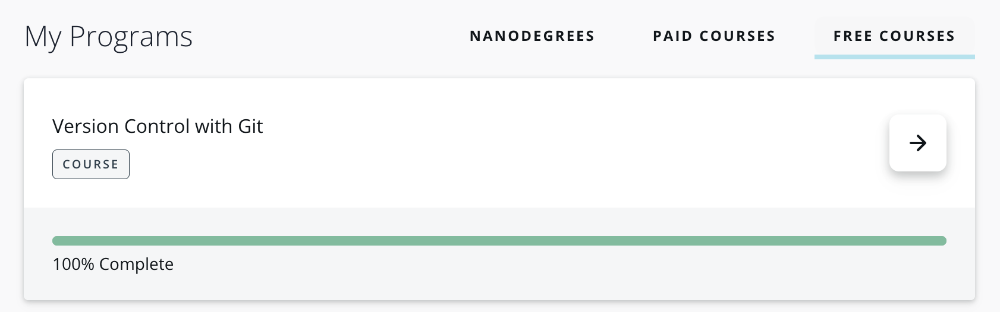
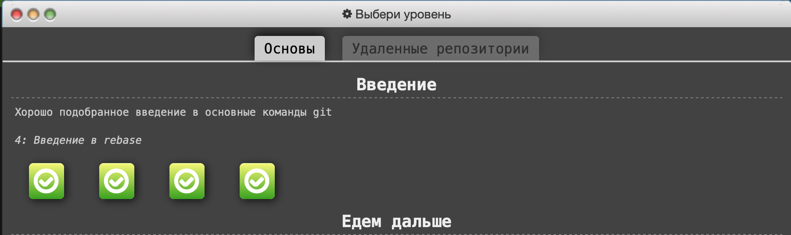
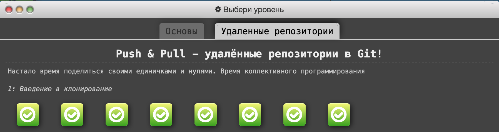

# kottans-frontend
 A repo for Kottans learning course

 This course is really awesome, I'm amazed how people
 can help each other to learn something useful and new. Hope I'll help somebody too:)

--- 
## GIT Basics
Good to recall some basic knowledge. Now I finally understand how git works and how to work with branches

Udacity✅ 
LearningItBranching✅ 

--- 
## Linux CLI and Networking
Currently in progress...