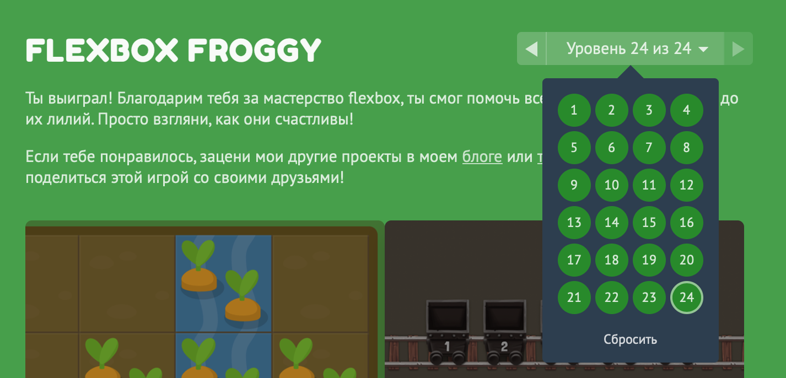
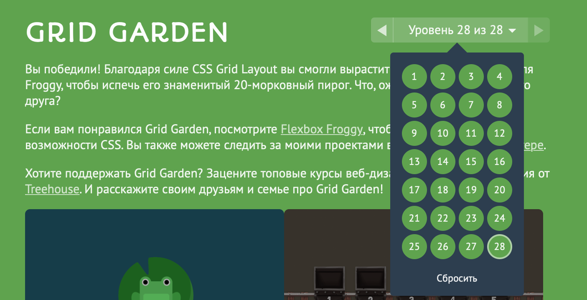

# kottans-frontend
 A repo for Kottans learning course

 This course is really awesome, I'm amazed how people
 can help each other to learn something useful and new. Hope I'll help somebody too:)

## Stage 0. Self-Study
### General
- [x] 0. Git Basics
- [x] 1. Linux CLI and Networking
- [x] 2. VCS, GitHub and Collaborating

### Front-End Basics
- [x] 3. Intro to HTML & CSS
- [x] 4. Responsive Web Design
- [x] 5. HTML & CSS Practice
- [ ] 6. JavaScript Basics
- [ ] 7. Document Object Model

### Advanced Topics
- [ ] 8. Building a Tiny JS World (pre-OOP)
- [ ] 9. Object oriented JS
- [ ] 10. OOP exercise
- [ ] 11. Offline Web Applications
- [ ] 12. Memory pair game
- [ ] 13. Website Performance Optimization
- [ ] 14. Friends App

--- 
## GIT Basics
Good to recall some basic knowledge. Now I finally understand how git works and how to work
with branches

 
Results

 
 
 
 

--- 
## Linux CLI and Networking
Learned a lot of new linux commands and figured out how to use some old in different way.
Finally, I understand how "|" works.

Read about HTTP protocol, together with new cli commands it will be really useful even
on my current job as system engineer.

 
Results

 
 
 
 
 

---
## Git Collaboration
This material was really challenging. On my mind, it's really difficult to understand
such details of git without practice, so I'm looking forward to use new commands in 
the future.

 
Results

 
 
 
 

---
## Intro to HTML and CSS
On my mind, this material could be good just with Codeacademy practice, because they 
give same information as teacher on Coursera lectures, but may be for somebody repeating
same information could be useful in learning. Looking forward to continue practicing html and css.

 
Results

 
 
 

---

---
## Responsive Web Design
That was good, I really like when learning combined with gaming practice. Now I know some basics of 
css flexboxes and grids, that'll be really useful.

 
Results

---

---
## HTML & CSS Practice
Some things were really challenging, but when I have understood how to make popup button via hidden checkbox - 
things became easier:) Also it was some sort of quest to make more button, but now it's done! 

<a href="https://andrewbersh.github.io/" target="_blank">Link to website</a>

---