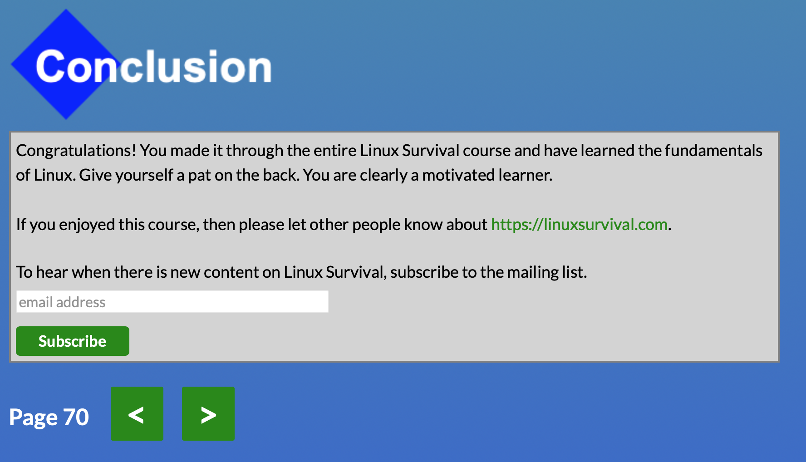
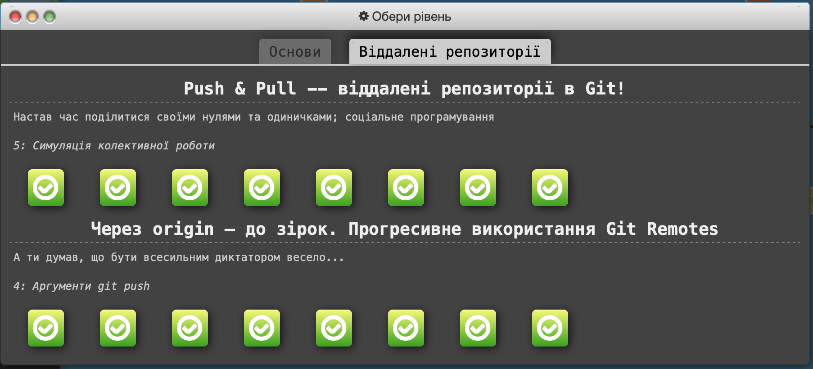

# kottans-frontend
 A repo for Kottans learning course

 This course is really awesome, I'm amazed how people
 can help each other to learn something useful and new. Hope I'll help somebody too:)

--- 
## GIT Basics
Good to recall some basic knowledge. Now I finally understand how git works and how to work
with branches

Results

--- 
## Linux CLI and Networking
Learned a lot of new linux commands and figured out how to use some old in different way.
Finally, I understand how "|" works.

Read about HTTP protocol, together with new cli commands it will be really useful even
on my current job as system engineer.

Results

---
## Git Collaboration
This material was really challenging. On my mind, it's really difficult to understand
such details of git without practice, so I'm looking forward to use new commands in 
the future.

Results

---